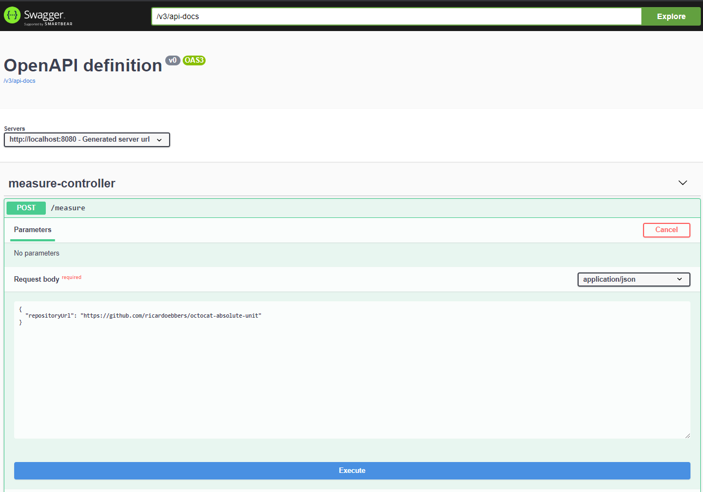

# Octocat Absolute Unit
Octocat Absolute Unit is a simple API that returns the total number of lines and bytes of all files
 in a given public Github repository
 
## Testing
This project is available on [Heroku](https://octocat-absolute-unit.herokuapp.com/swagger-ui.html)
### Measure lines and bytes of a public github repository
You can use the Swagger UI interface to POST a request:

Or just use ```curl``` like this:
```
curl -X POST "https://octocat-absolute-unit.herokuapp.com/measure" -H "accept: */*" -H "Content-Type: application/json" -d "{\"repositoryUrl\":\"https://github.com/ricardoebbers/octocat-absolute-unit\"}"
```
It will take some time depending on the size of the repository, but the expected result should be something like this:
```
{
  "uri": "/ricardoebbers/octocat-absolute-unit",
  "measurements": {
    "": {
      "lines": 206,
      "sloc": 179,
      "bytes": 6840
    },
    "gradle": {
      "lines": 56,
      "sloc": 45,
      "bytes": 1640
    },
    "bat": {
      "lines": 104,
      "sloc": 78,
      "bytes": 2949
    },
    "gitignore": {
      "lines": 31,
      "sloc": 27,
      "bytes": 333
    },
    "md": {
      "lines": 10,
      "sloc": 7,
      "bytes": 315
    },
    "kt": {
      "lines": 405,
      "sloc": 336,
      "bytes": 13453
    },
    "yml": {
      "lines": 19,
      "sloc": 19,
      "bytes": 371
    },
    "jar": {
      "lines": 0,
      "sloc": 0,
      "bytes": 58880
    },
    "properties": {
      "lines": 5,
      "sloc": 5,
      "bytes": 202
    }
  },
  "totalLines": 836,
  "totalSloc": 696,
  "totalBytes": 84983
}
```
Subsequent calls to the same repository URL should be significant faster.


## Installation
### Pre-requisites
You will need [JDK 11](https://adoptopenjdk.net/?variant=openjdk11&jvmVariant=openj9) installed

### Running locally
Clone the repository:
```
git clone https://github.com/ricardoebbers/octocat-absolute-unit && cd octocat-absolute-unit
```
Run gradle task:
```
./gradlew bootRun
```
Open your browser [locally](http://localhost:8080/swagger-ui.html)
